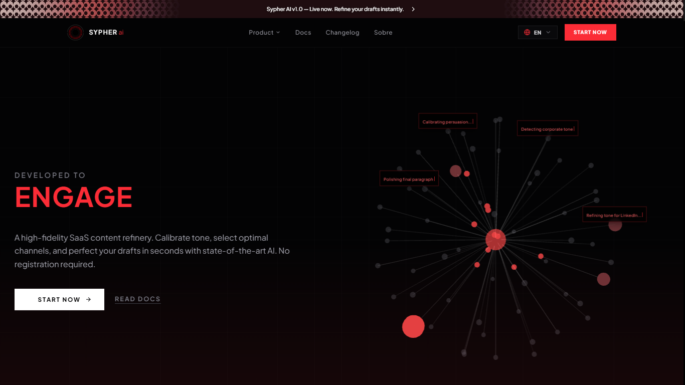
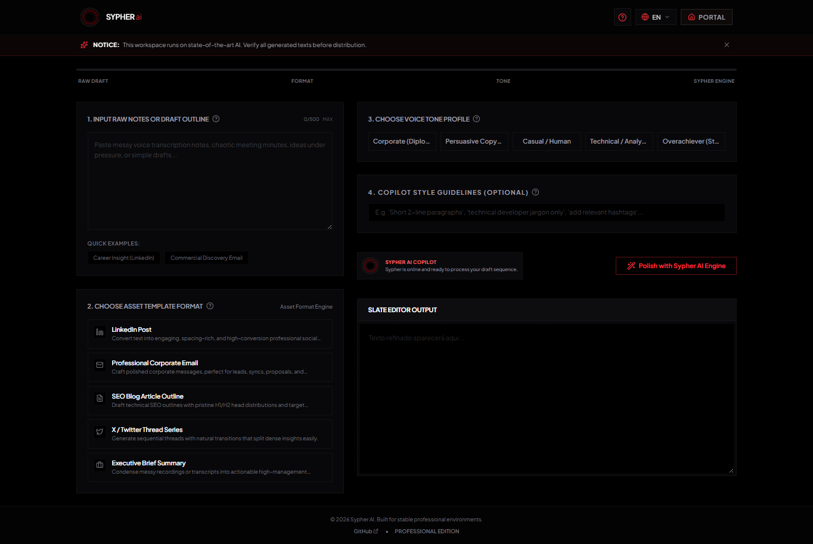

<div align="center">


# Sypher AI

**Premium web platform for AI-powered text refinement — polish your writing for LinkedIn, Twitter/X, email, and more.**

**Live at [sypher.ia.br](https://sypher.ia.br)**


</div>

---



---

# ⭕ Overview

Sypher AI is a **premium text refinement platform** designed to help professionals, creators, and teams turn rough drafts into polished, high-impact content.

The platform refines text for multiple contexts, including:

- LinkedIn posts
- Twitter/X posts
- Emails
- General professional writing

All refinements are powered by **Google Gemini**, combined with a custom prompt and data abstraction layer tailored to each content format.

---

# ⭕ Tech Stack

Sypher AI runs on a modern, fully Serverless full-stack architecture on AWS, focused on performance, polish, and a premium user experience.

### Frontend


### Backend


### Cloud & Infrastructure


### AI Integration


---

# ⭕ Architecture

Sypher AI is hosted on a 100% Serverless architecture on AWS:

- **Frontend** — static build served from **Amazon S3**, distributed globally through **Amazon CloudFront**.
- **Backend** — REST API built with **Express.js**, running inside **AWS Lambda** functions integrated with **API Gateway v2 (HTTP API)**.
- **Routing & CORS** — CloudFront acts as a single entry point, routing frontend and API traffic (`/api/*`) through the same domain, solving CORS natively and reducing overall network latency.
- **DNS & SSL** — domain and DNS managed via **Cloudflare** / Registro.br, with SSL/TLS certificates issued through **AWS Certificate Manager (ACM)**.
- **Performance** — backend deploy package optimized with **esbuild** (tree shaking + strict production dependency isolation), reducing bundle size by **97%** (~80MB → 1.5MB) and drastically improving Lambda cold start time.

```
Frontend (React + Vite) — Amazon S3 + CloudFront
│
├── Landing / Docs / About Pages
├── Text Refinement Interface
├── AI Demo Preview
└── Data Visualization Layer (Recharts)

Backend (Node.js + Express) — AWS Lambda + API Gateway v2
│
├── API Layer
├── Prompt / Data Abstraction Layer
└── Gemini AI Integration
```

---

# ⭕ How It Works

Paste your raw text, choose the target platform — LinkedIn, Twitter/X, email, or general writing — and let Sypher AI refine it through the Gemini-powered prompt layer. Each format has its own tone, length, and structural rules, applied automatically during refinement.



Compare the original draft with the refined version and export the final result. The refinement evaluates:

- Tone and voice consistency
- Clarity and readability
- Platform-specific structure
- Overall persuasive impact

---

# 📊 Key Features

- **AI-Powered Text Refinement** – Refine drafts using Google Gemini with a custom prompt/data abstraction layer.
- **Multi-Format Support** – Tailored refinement for LinkedIn posts, Twitter/X posts, emails, and general writing.
- **Before/After Comparison** – Instantly compare the original draft with the refined version.
- **Premium Animated Experience** – Smooth, high-end interactions powered by GSAP, Motion, and Three.js.
- **Data Visualization** – Track and visualize refinement metrics with Recharts.
- **Modern, Responsive Interface** – Built with React 19, Vite, and TailwindCSS for a fast, polished experience.
- **Fully Serverless Deployment** – 100% Serverless AWS architecture (Lambda, API Gateway, S3, CloudFront), with a 97% smaller backend deploy package via esbuild optimization.

---

# 📁 Project Structure

```
src/
├── assets/
│   └── images/
├── components/
│   ├── LandingPage.tsx
│   ├── DocsPage.tsx
│   ├── AboutPage.tsx
│   ├── AppDemoPreview.tsx
│   └── ...
├── data.ts
├── translations.ts
├── types.ts
└── main.tsx

public/
├── gifs/
├── img/icons/
├── decorative-bar.png

docs/
└── screenshots/
    ├── screenshot-1.png
    └── screenshot-2.png
```

---

# 📦 Local Development

Clone the repository:

```
git clone https://github.com/Gustaavo-404/sypher-ai.git
cd sypher-ai
```

Install dependencies:

```
npm install
```

### Environment Variables

Create a `.env` file in the project root:

```
GEMINI_API_KEY=your_api_key_here
VITE_API_URL=your_backend_api_url_here
```

You can obtain your Gemini API key via [Google AI Studio](https://aistudio.google.com/).

`VITE_API_URL` should point to your backend endpoint (e.g. `http://localhost:3001` for local development, or the deployed API Gateway URL in production).

### Running the Development Server

```
npm run dev
```

Then open [http://localhost:3000](http://localhost:3000). The application will automatically reload when changes are made.

### Running with Docker

```
docker build -t sypher-ai .
docker run -d -p 3000:3000 --env-file .env --name sypher-ai sypher-ai
```

Access at [http://localhost:3000](http://localhost:3000).

---

# 🎯 Use Cases

Sypher AI is designed for:

- Content creators
- Marketing professionals
- Job seekers refining their LinkedIn presence
- Founders and freelancers
- Anyone writing high-stakes professional text

---

# 📈 Future Roadmap

Planned improvements:

- Additional platform formats (Instagram, Medium, etc.)
- Tone presets and custom voice profiles
- Team/collaborative refinement workflows
- Refinement history and analytics dashboard
- Browser extension for inline refinement

---

# 📄 License

Sypher AI is licensed under the MIT License.

---

<div align="center">

⭕ **Sypher AI — From Draft to Excellence.**

</div>
